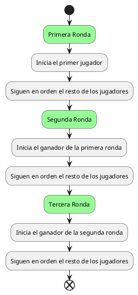
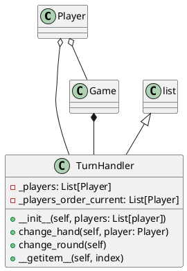

```plantuml
@startuml
start
    #palegreen:Primera Ronda;
        :Inicia el primer jugador;
        :Siguen en orden el resto de los jugadores;
    #palegreen:Segunda Ronda;
        :Inicia el ganador de la primera ronda;
        :Siguen en orden el resto de los jugadores;
    #palegreen:Tercera Ronda;
        :Inicia el ganador de la segunda ronda;
        :Siguen en orden el resto de los jugadores;
end
@enduml
```

```plantuml
@startuml
Player o-- TurnHandler
Player o-- Game
Game *-- TurnHandler
list <|-- TurnHandler
class TurnHandler{
    - _players: List[Player]
    - _players_order_current: List[Player]
    + __init__(self, players: List[player])
    + change_hand(self, player: Player)
    + change_round(self)
    + __getitem__(self, index)
}
@enduml
```